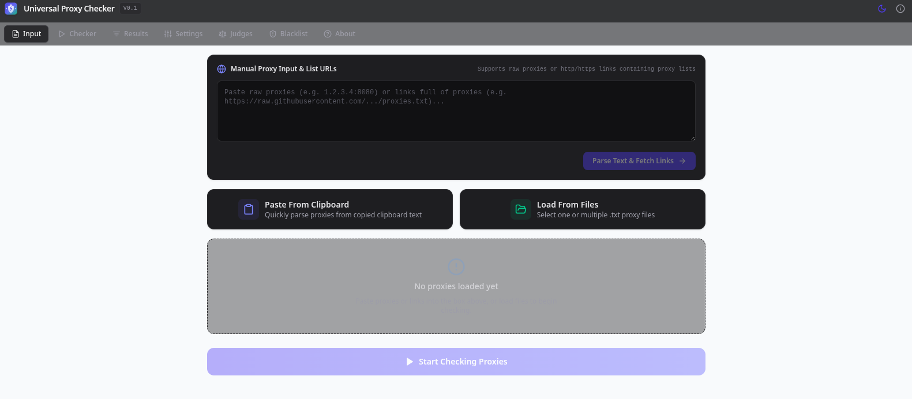

# ⚡ Universal Proxy Checker v0.1

[](https://github.com/tazihad/universal-proxy-checker)
[](LICENSE)
[](https://react.dev/)
[](https://www.typescriptlang.org/)
[](https://vitejs.dev/)
[](https://tailwindcss.com/)

**Universal Proxy Checker** is a high-performance, ultra-fast, multithreaded proxy verification application built with React 19, TypeScript, Vite 6, and Tailwind CSS v4.

It supports verifying raw proxy lists (`host:port`, `user:pass@host:port`, `host:port:user:pass`, `socks5://...`) as well as live subscription proxy list URLs (`http://...` / `https://...`).

---

## 📸 Application Interface



---

## ✨ Features

- **🚀 High Concurrency Engine**: Multithreaded asynchronous verification engine supporting up to 500 concurrent worker threads with low memory consumption and `AbortController` cancellation.
- **🌐 Dual Source Loading**:
  - **Manual Text & URL Box**: Paste raw proxies or enter `http://` / `https://` proxy list links (automatically fetches remote list contents).
  - **File Upload & Clipboard**: Load single/multiple `.txt` proxy files or paste straight from clipboard.
- **🛡️ Full Protocol Coverage**: Check **HTTP**, **HTTPS (SSL)**, **SOCKS4**, and **SOCKS5** protocols concurrently or individually.
- **📋 1-Click Copy**: Click on any IP address or Port in the Results table to copy it instantly with a clean floating UI notification toast.
- **📊 Real-time Analytics & Stats**: Speed gauge (`proxies/sec`), progress bar, elapsed & ETA timers, and live breakdown counters.
- **⚡ Filter & Sorting Engine**:
  - Search by IP, Port, Country, or Server.
  - Anonymity filter: **Elite**, **Anonymous**, **Transparent**.
  - Protocol & Keep-Alive connection filters.
  - Port Allow / Block filter (`80, 8080, 3128`).
  - Max latency slider filter (100ms - 60,000ms).
  - Country modal filter with country flags & search.
- **🔍 Full Proxy Inspector**: View detailed response headers, timing breakdowns, judge URL used, and response body snippets.
- **📦 Versatile Exporter**: Export in `Host:Port` or `Protocol://Host:Port` formats with custom auth formatting (`User:Pass@Host:Port` or `Host:Port:User:Pass`).
- **⚖️ Judges & Blacklist Managers**: Configure custom HTTP/SSL judges with validation regex/string and IP blacklist databases.
- **🎨 Persistent Theme Toggle**: Sleek Light & Dark mode with `localStorage` persistence.

---

## 🛠️ Tech Stack

- **Frontend Core**: [React 19](https://react.dev/), [TypeScript 5.7](https://www.typescriptlang.org/)
- **Build Tool**: [Vite 6](https://vitejs.dev/)
- **Styling**: [Tailwind CSS v4](https://tailwindcss.com/)
- **Icons**: [Lucide React](https://lucide.dev/)

---

## 🚀 Quick Start

### Prerequisites
- [Node.js](https://nodejs.org/) (v18 or higher recommended)
- `npm` or `yarn`

### Installation

1. **Clone the repository**:
   ```bash
   git clone https://github.com/tazihad/universal-proxy-checker.git
   cd universal-proxy-checker
   ```

2. **Install dependencies**:
   ```bash
   npm install
   ```

3. **Start local development server**:
   ```bash
   npm run dev
   ```
   Open your browser at `http://localhost:3000/`.

4. **Build for production**:
   ```bash
   npm run build
   ```

---

## 📖 Usage Guide

1. **Load Proxies**:
   - Open the **Input** tab.
   - Paste raw proxies or proxy subscription URLs into the top box and click **Parse Text & Fetch Links**.
   - Alternatively, click **Paste From Clipboard** or **Load From Files**.
2. **Start Verification**:
   - Click **Start Checking Proxies**.
3. **Inspect & Filter**:
   - Navigate to the **Results** tab to sort and filter active proxies.
   - Click on any **IP** or **Port** to copy it directly.
   - Click any proxy row to open the full inspection modal.
4. **Export**:
   - Click **Export** to copy or download your filtered proxies in your preferred format.

---

## 👤 Author

Developed by **tazihad**
- **GitHub**: [@tazihad](https://github.com/tazihad)
- **Repository**: [https://github.com/tazihad/universal-proxy-checker](https://github.com/tazihad/universal-proxy-checker)

---

## 📄 License

This project is licensed under the MIT License - see the [LICENSE](LICENSE) file for details.
